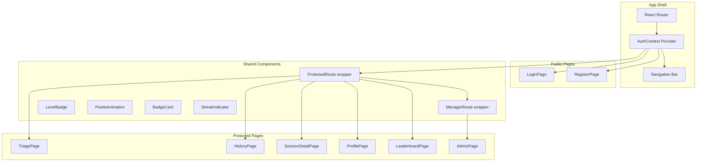
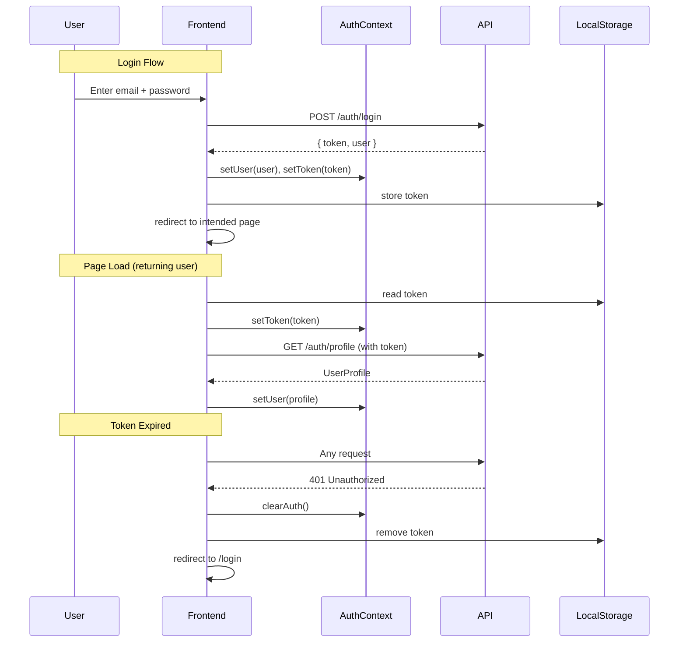
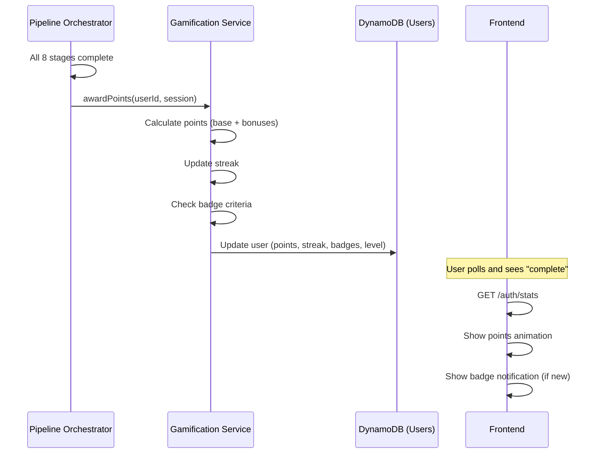

# Design Document: Frontend Auth, History, Admin & Gamification

## Overview

This feature transforms the ReSource AI frontend from a single-page triage tool into a full multi-page application with user authentication flows, session history, an admin panel, and a gamification system. The backend is extended with gamification logic (points, badges, streaks, levels) and new endpoints for user stats and leaderboard.

### Key Design Decisions

1. **React Router for navigation**: The app currently has no routing — it's a single-page form/results flow. Adding react-router-dom enables proper page navigation, protected routes, and deep linking to session history.

2. **AuthContext with localStorage persistence**: JWT stored in localStorage for persistence across refreshes. A React Context provides auth state to all components without prop drilling. Token is included in all API calls via a centralized fetch wrapper.

3. **Gamification in DynamoDB (same users table)**: Points, badges, streak, and level are stored as attributes on the existing users table. No new table needed. This keeps reads fast (single GetItem for profile + stats).

4. **Points awarded in pipeline orchestrator**: After marking a session complete, the pipeline Lambda calls a gamification service that calculates points, updates streak, checks badge criteria, and writes to the users table. This is synchronous within the pipeline Lambda (adds ~100ms).

5. **Leaderboard via DynamoDB scan**: For the expected user count (<1000), a scan sorted client-side is acceptable. For scale, a GSI on points would be needed, but that's premature optimization here.

6. **Existing dark glassmorphism design**: All new pages follow the existing design language — dark theme, glassmorphism cards, Framer Motion animations, Tailwind CSS v4.

## Architecture

### Frontend Route Structure

```
/                   → TriagePage (form + results) [protected]
/login              → LoginPage [public]
/register           → RegisterPage [public]
/history            → HistoryPage [protected]
/history/:sessionId → SessionDetailPage [protected]
/profile            → ProfilePage [protected]
/leaderboard        → LeaderboardPage [protected]
/admin              → AdminPage [protected, manager only]
```

### Component Architecture



### Auth Flow



### Gamification Flow



## Components and Interfaces

### New Frontend Components

| Component | Responsibility |
|-----------|---------------|
| `AuthProvider` | React Context provider managing user/token state, login/register/logout functions |
| `ProtectedRoute` | Route wrapper that redirects to /login if unauthenticated |
| `ManagerRoute` | Route wrapper that redirects to / if user role is not "manager" |
| `NavBar` | Persistent navigation with auth-aware links, level badge, points display |
| `LoginPage` | Login form with validation, error display, link to register |
| `RegisterPage` | Registration form with validation, confirm password, link to login |
| `ProfilePage` | User profile display + edit, gamification stats, badges grid |
| `HistoryPage` | Paginated list of user's past sessions with summary cards |
| `SessionDetailPage` | Full triage results for a specific past session (reuses ResultsView) |
| `LeaderboardPage` | Top 20 users ranked by points with current user highlighted |
| `AdminPage` | Tabbed interface for user management and session oversight |
| `LevelBadge` | Visual indicator of user's current level with icon |
| `PointsAnimation` | Animated "+X points" overlay after session completion |
| `BadgeCard` | Individual badge display (earned = colored, unearned = greyed) |
| `BadgeUnlockToast` | Toast notification when a new badge is earned |
| `StreakIndicator` | Flame/streak icon with count |
| `ProgressBar` | Points progress toward next level |

### New Backend Components

| Component | Responsibility |
|-----------|---------------|
| `GamificationService` | Calculates points, updates streak, checks badge criteria, updates user record |
| `StatsHandler` | GET /auth/stats — returns user's gamification data |
| `LeaderboardHandler` | GET /leaderboard — returns top 20 users by points |
| `UserSessionsHandler` | GET /sessions — returns authenticated user's sessions (paginated) |

### New/Updated API Endpoints

| Method | Path | Auth | Handler | Description |
|--------|------|------|---------|-------------|
| GET | `/sessions` | JWT | UserSessionsHandler | List current user's sessions (paginated) |
| GET | `/auth/stats` | JWT | StatsHandler | Get user's gamification stats |
| GET | `/leaderboard` | JWT | LeaderboardHandler | Get top 20 users by points |

### Updated Existing Endpoints

| Endpoint | Change |
|----------|--------|
| Pipeline Orchestrator | After session completion, call GamificationService to award points |

## Data Models

### User Table Updates (existing `resource-ai-users`)

```typescript
interface User {
  // ... existing fields ...
  userId: string;
  email: string;
  passwordHash: string;
  displayName: string;
  role: UserRole;
  createdAt: string;
  updatedAt: string;

  // NEW gamification fields
  points: number;              // Total points earned (default 0)
  level: UserLevel;            // Calculated from points
  streak: number;              // Current weekly streak (default 0)
  badges: string[];            // Array of badge IDs earned (default [])
  lastTriageDate: string | null; // ISO date of last completed triage
  totalSessions: number;       // Count of completed sessions (default 0)
}

type UserLevel = 'Recycler' | 'Salvager' | 'E-Waste Champion' | 'Green Guardian';
```

### Level Thresholds

```typescript
const LEVEL_THRESHOLDS = [
  { level: 'Recycler', minPoints: 0, maxPoints: 499 },
  { level: 'Salvager', minPoints: 500, maxPoints: 1499 },
  { level: 'E-Waste Champion', minPoints: 1500, maxPoints: 3999 },
  { level: 'Green Guardian', minPoints: 4000, maxPoints: Infinity },
] as const;
```

### Points Calculation

```typescript
interface PointsBreakdown {
  base: 100;                    // Every completed session
  photoBonus: 25;              // If fileIds.length > 0
  greenBonus: 50;              // If final riskLevel === 'Green'
  detailedInputBonus: 25;      // If all 3 text fields > 200 chars
}
// Max per session: 200 points
```

### Badge Definitions

```typescript
const BADGES = [
  { id: 'first-triage', name: 'First Triage', description: 'Complete your first triage', icon: '🌱', criteria: (u) => u.totalSessions >= 1 },
  { id: 'regular-recycler', name: 'Regular Recycler', description: 'Complete 5 triages', icon: '♻️', criteria: (u) => u.totalSessions >= 5 },
  { id: 'hazard-spotter', name: 'Hazard Spotter', description: 'Submit a Red-risk device', icon: '⚠️', criteria: (session) => session.riskLevel === 'Red' },
  { id: 'parts-hunter', name: 'Parts Hunter', description: 'Find 10+ salvageable parts', icon: '🔧', criteria: (u) => u.totalSalvageableParts >= 10 },
  { id: 'streak-master', name: 'Streak Master', description: 'Maintain a 4-week streak', icon: '🔥', criteria: (u) => u.streak >= 4 },
  { id: 'green-champion', name: 'Green Champion', description: '5 Green-risk outcomes', icon: '🌿', criteria: (u) => u.greenOutcomes >= 5 },
] as const;
```

### API Response Types

```typescript
interface UserStatsResponse {
  points: number;
  level: UserLevel;
  streak: number;
  badges: BadgeInfo[];
  totalSessions: number;
  lastTriageDate: string | null;
  pointsToNextLevel: number;
  nextLevel: UserLevel | null;
}

interface BadgeInfo {
  id: string;
  name: string;
  description: string;
  icon: string;
  earnedAt: string | null;  // null = not yet earned
}

interface LeaderboardEntry {
  rank: number;
  displayName: string;
  level: UserLevel;
  points: number;
  badgeCount: number;
  isCurrentUser: boolean;
}

interface LeaderboardResponse {
  entries: LeaderboardEntry[];
  currentUserRank: number | null;
}

interface UserSessionsResponse {
  sessions: SessionSummary[];
  total: number;
  limit: number;
  offset: number;
}

interface SessionSummary {
  sessionId: string;
  deviceName: string;       // from quickVerdict.deviceIdentification
  riskLevel: RiskLevel | null;
  salvageScore: number | null;
  status: 'processing' | 'complete' | 'failed';
  createdAt: string;
  pointsEarned: number;
}
```

## Frontend Auth Implementation

### API Service Updates

```typescript
// services/api.ts — Updated to include auth headers

class ApiClient {
  private baseUrl: string;
  private apiKey: string;
  private getToken: () => string | null;

  constructor(baseUrl: string, apiKey: string, getToken: () => string | null) {
    this.baseUrl = baseUrl;
    this.apiKey = apiKey;
    this.getToken = getToken;
  }

  private async fetch(path: string, options: RequestInit = {}): Promise<Response> {
    const headers: Record<string, string> = {
      'Content-Type': 'application/json',
      'x-api-key': this.apiKey,
      ...options.headers as Record<string, string>,
    };

    const token = this.getToken();
    if (token) {
      headers['Authorization'] = `Bearer ${token}`;
    }

    const response = await fetch(`${this.baseUrl}${path}`, {
      ...options,
      headers,
    });

    if (response.status === 401) {
      // Trigger logout via event or callback
      window.dispatchEvent(new Event('auth:expired'));
    }

    return response;
  }

  // Auth endpoints (no JWT needed)
  async register(data: RegisterRequest): Promise<LoginResponse> { ... }
  async login(data: LoginRequest): Promise<LoginResponse> { ... }

  // Protected endpoints
  async getProfile(): Promise<UserProfile> { ... }
  async updateProfile(data: ProfileUpdateRequest): Promise<UserProfile> { ... }
  async getStats(): Promise<UserStatsResponse> { ... }
  async getLeaderboard(): Promise<LeaderboardResponse> { ... }
  async getUserSessions(limit?: number, offset?: number): Promise<UserSessionsResponse> { ... }
  async getSession(sessionId: string): Promise<PollSessionResponse> { ... }
  async submitSession(data: CreateSessionRequest): Promise<CreateSessionResponse> { ... }
  async uploadFile(file: File): Promise<UploadFileResponse> { ... }

  // Admin endpoints
  async getAdminUsers(limit?: number, offset?: number): Promise<UsersListResponse> { ... }
  async updateUserRole(userId: string, role: UserRole): Promise<UserProfile> { ... }
  async getAdminSessions(limit?: number, offset?: number, userId?: string): Promise<SessionsListResponse> { ... }
}
```

### AuthContext Shape

```typescript
interface AuthContextValue {
  user: UserProfile | null;
  token: string | null;
  isAuthenticated: boolean;
  isLoading: boolean;
  login: (email: string, password: string) => Promise<void>;
  register: (email: string, password: string, displayName: string) => Promise<void>;
  logout: () => void;
  updateProfile: (displayName: string) => Promise<void>;
}
```

## Error Handling

| Scenario | Frontend Behavior |
|----------|-------------------|
| 401 from any API call | Clear auth state, redirect to /login, show "Session expired" toast |
| 403 on admin route | Redirect to /, show "Access denied" toast |
| 409 on register | Show "Email already registered" below email field |
| 401 on login | Show "Invalid credentials" as form-level error |
| Network error | Show "Connection error, please try again" toast |
| 404 on session detail | Show "Session not found" with link back to history |

## UI Design Notes

All new pages follow the existing design system:
- Dark background with gradient animation
- Glassmorphism cards (backdrop-blur, semi-transparent backgrounds)
- Framer Motion for page transitions and element animations
- Tailwind CSS v4 utility classes
- Lucide React icons
- Color palette: primary (teal/cyan), surface (dark grays), text (white/gray)
- Responsive: mobile-first, scales to desktop

### Gamification Visual Design
- Level badges: Colored icons with glow effects matching the level tier
- Points animation: Floating number that fades up and out
- Badge cards: Rounded cards with icon, name, and earned date (or greyed silhouette)
- Streak: Flame icon with number, pulsing animation when active
- Progress bar: Gradient fill showing points toward next level
- Leaderboard: Table with rank medals (gold/silver/bronze for top 3), current user row highlighted
