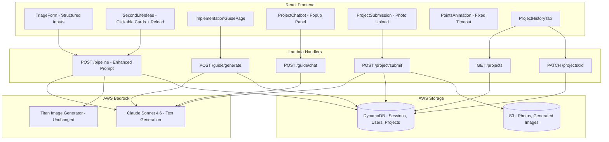

# Design Document: Gamification Expansion

## Overview

This design expands the ReSource AI e-waste recycling application from a scanning/triage tool into a full recycling action platform. The expansion touches all layers of the stack: frontend React components, backend Lambda handlers, AI prompt construction, data models, and infrastructure.

The key architectural additions are:
1. **Points Animation Bug Fix** — Adding a safety timeout to the existing `PointsAnimation` component to prevent stuck overlays
2. **Structured User Context** — Replacing the free-text `userContext` field with structured selectors (expertise, motivation, materials, time)
3. **Enhanced Second Life Ideas** — Context-aware idea generation with clickable cards and reload capability
4. **Implementation Guide** — A new page with AI-generated step-by-step project instructions
5. **Project Chatbot** — A popup chat scoped to the current project on the Implementation Guide page
6. **Project Submission & AI Grading** — Multi-photo upload with AI-based A-F grading and points
7. **User Project History** — Tabbed layout tracking project lifecycle (In Progress, Completed, Abandoned)
8. **AI Model Upgrade** — Migrating from Amazon Nova Pro to Claude Sonnet 4.6 on AWS Bedrock

### Design Decisions

- **Structured context over free-text**: Structured inputs enable deterministic filtering (e.g., skill-level gating) and produce more consistent AI outputs than free-text parsing.
- **Single Implementation Guide page**: Rather than separate pages for guide, chat, and submission, all project interaction lives on one page to reduce navigation friction.
- **Client-side conversation history**: Chat history is stored in React state (not persisted to backend) since it's session-scoped and cleared on navigation.
- **Grade-based points as a pure mapping**: The grade-to-points function is a simple lookup table, making it trivially testable and easy to adjust.
- **Retry with cap**: Submission retries are capped at 3 to prevent infinite loops while giving users a fair chance on transient failures.

## Architecture



### Request Flow

1. **Triage Flow (Enhanced)**: User fills structured context → submits → pipeline runs with structured context in prompts → results displayed with clickable idea cards
2. **Implementation Guide Flow**: User clicks idea card → navigates to `/guide/:projectId` → API generates detailed instructions → page renders guide + chatbot toggle + submission section
3. **Chat Flow**: User opens chatbot → sends message → backend constructs scoped prompt (project context + conversation history) → Claude responds → displayed in chat panel
4. **Submission Flow**: User uploads 2-6 photos → submits → backend sends photos to Claude for grading → grade + points returned → animation plays → stored in history
5. **History Flow**: User views Projects tab → paginated list of projects with status → click navigates to guide page

## Components and Interfaces

### Frontend Components

#### PointsAnimation (Modified)
```typescript
interface PointsAnimationProps {
  points: number;
  visible: boolean;
  onComplete?: () => void;
}
// Changes: Add useEffect with 3-second setTimeout as safety fallback
// that force-hides and calls onComplete if animation hasn't dismissed
```

#### StructuredContextInput (New)
```typescript
interface StructuredUserContext {
  expertiseLevel: 'Beginner' | 'Intermediate' | 'Expert';
  motivation: 'Learn Something New' | 'Environmental Impact' | 'Save Money' | 'Creative Project';
  materialAvailability: 'Basic Household Tools' | 'Some Electronics Tools' | 'Full Workshop';
  timeCommitment: 'Under 1 Hour' | '1-3 Hours' | 'Half Day' | 'Multi-Day Project';
}

interface StructuredContextInputProps {
  value: Partial<StructuredUserContext>;
  onChange: (context: Partial<StructuredUserContext>) => void;
}
```

#### IdeaCard (New)
```typescript
interface IdeaCardProps {
  idea: ProjectIdea;
  onClick: (idea: ProjectIdea) => void;
}
```

#### SecondLifeIdeasSection (New)
```typescript
interface SecondLifeIdeasSectionProps {
  ideas: ProjectIdea[];
  userExpertise: ExpertiseLevel;
  onIdeaClick: (idea: ProjectIdea) => void;
  onReload: () => void;
  isReloading: boolean;
  reloadError: string | null;
}
```

#### ImplementationGuidePage (New)
```typescript
interface ImplementationGuide {
  materials: string[];          // 3-15 items
  steps: InstructionStep[];     // 5-20 items
  estimatedTime: string;        // e.g., "2-3 hours"
  safetyWarnings: string[];     // at least 1 per hazardous component, or "No specific safety concerns"
}

interface InstructionStep {
  stepNumber: number;
  instruction: string;
  explanation?: string;         // Present for Beginner level
}
```

#### ProjectChatbot (New)
```typescript
interface ChatMessage {
  id: string;
  role: 'user' | 'assistant';
  content: string;
  timestamp: number;
}

interface ProjectChatbotProps {
  projectContext: ProjectContext;
  isOpen: boolean;
  onToggle: () => void;
}
// Max 50 messages in history, cleared on navigation away
```

#### ProjectSubmission (New)
```typescript
interface SubmissionResult {
  grade: 'A' | 'B' | 'C' | 'D' | 'F';
  points: number;
  feedback: string;
  photoKeys: string[];
  submittedAt: string;
}

interface ProjectSubmissionProps {
  projectId: string;
  guideContext: ImplementationGuide;
  existingResult?: SubmissionResult;
  onGraded: (result: SubmissionResult) => void;
}
// Accepts JPEG, PNG, WebP; max 5MB per photo; 2-6 photos required
```

#### ProjectHistoryTab (New)
```typescript
interface ProjectHistoryEntry {
  projectId: string;
  ideaTitle: string;
  startedAt: string;
  status: 'in-progress' | 'completed' | 'abandoned';
  grade?: 'A' | 'B' | 'C' | 'D' | 'F';
  pointsEarned?: number;
}

interface ProjectHistoryTabProps {
  projects: ProjectHistoryEntry[];
  totalCount: number;
  onLoadMore: () => void;
  onNavigate: (projectId: string) => void;
  onAbandon: (projectId: string) => void;
  onDelete: (projectId: string) => void;
}
// 10 projects per page with load-more control
```

### Backend API Endpoints

#### POST /guide/generate (New)
```typescript
interface GenerateGuideRequest {
  ideaTitle: string;
  ideaDescription: string;
  requiredComponents: string[];
  additionalMaterials: string[];
  userContext: StructuredUserContext;
  sessionId: string;
}

interface GenerateGuideResponse {
  guide: ImplementationGuide;
}
```

#### POST /guide/chat (New)
```typescript
interface ChatRequest {
  message: string;              // max 500 characters
  projectContext: {
    ideaTitle: string;
    materials: string[];
    steps: string[];
    deviceInfo: string;
  };
  conversationHistory: ChatMessage[];  // max 50 messages
}

interface ChatResponse {
  reply: string;
}
```

#### POST /project/submit (New)
```typescript
interface SubmitProjectRequest {
  projectId: string;
  photoFileIds: string[];       // 2-6 S3 file keys
  guideContext: {
    ideaTitle: string;
    expectedOutcome: string;
    steps: string[];
  };
}

interface SubmitProjectResponse {
  grade: 'A' | 'B' | 'C' | 'D' | 'F';
  points: number;
  feedback: string;
}
```

#### GET /projects (New)
```typescript
interface ProjectsListResponse {
  projects: ProjectHistoryEntry[];
  total: number;
  limit: number;    // 10
  offset: number;
}
```

#### PATCH /projects/:projectId (New)
```typescript
interface UpdateProjectRequest {
  action: 'abandon' | 'delete';
}
```

### BedrockClient (Modified)
```typescript
// Changes to invokeTextModel:
// - DEFAULT_TEXT_MODEL changes from 'apac.amazon.nova-pro-v1:0' to Claude Sonnet 4.6 model ID
// - Request body format changes to Anthropic Messages API schema
// - Response parsing changes to extract from content[0].text instead of output.message.content[0].text
```

## Data Models

### StructuredUserContext (New shared type)
```typescript
export type ExpertiseLevel = 'Beginner' | 'Intermediate' | 'Expert';
export type Motivation = 'Learn Something New' | 'Environmental Impact' | 'Save Money' | 'Creative Project';
export type MaterialAvailability = 'Basic Household Tools' | 'Some Electronics Tools' | 'Full Workshop';
export type TimeCommitment = 'Under 1 Hour' | '1-3 Hours' | 'Half Day' | 'Multi-Day Project';

export interface StructuredUserContext {
  expertiseLevel: ExpertiseLevel;
  motivation: Motivation;
  materialAvailability: MaterialAvailability;
  timeCommitment: TimeCommitment;
}
```

### TriageInputs (Modified)
```typescript
export interface TriageInputs {
  deviceIdentity: string;
  failureSymptoms: string;
  userContext: StructuredUserContext;  // Changed from string to structured type
  fileIds: string[];
}
```

### Project (New DynamoDB table: Projects)
```typescript
export interface Project {
  projectId: string;            // UUID v4 (partition key)
  userId: string;               // GSI partition key
  sessionId: string;            // Reference to originating triage session
  ideaTitle: string;
  ideaDescription: string;
  requiredComponents: string[];
  additionalMaterials: string[];
  userContext: StructuredUserContext;
  status: 'in-progress' | 'completed' | 'abandoned';
  guide?: ImplementationGuide;  // Cached generated guide
  submission?: {
    grade: 'A' | 'B' | 'C' | 'D' | 'F';
    points: number;
    feedback: string;
    photoKeys: string[];
    submittedAt: string;
  };
  startedAt: string;            // ISO 8601
  updatedAt: string;            // ISO 8601
}
```

### DynamoDB Table Design

| Table | Partition Key | Sort Key | GSI |
|-------|--------------|----------|-----|
| Projects | projectId | — | userId-index (userId, startedAt) |

### Grade Points Mapping
```typescript
export const PROJECT_GRADE_POINTS: Record<string, number> = {
  A: 500,
  B: 350,
  C: 200,
  D: 100,
  F: 25,
};
```

### Skill Level Ordering (for filtering)
```typescript
export const EXPERTISE_LEVEL_ORDER: Record<ExpertiseLevel, number> = {
  Beginner: 1,
  Intermediate: 2,
  Expert: 3,
};

export const IDEA_SKILL_TO_EXPERTISE: Record<SkillLevel, ExpertiseLevel> = {
  Beginner: 'Beginner',
  Intermediate: 'Intermediate',
  Advanced: 'Expert',
  Professional: 'Expert',
};
```

## Correctness Properties

*A property is a characteristic or behavior that should hold true across all valid executions of a system — essentially, a formal statement about what the system should do. Properties serve as the bridge between human-readable specifications and machine-verifiable correctness guarantees.*

### Property 1: Form validation completeness

*For any* combination of the four structured context fields (expertiseLevel, motivation, materialAvailability, timeCommitment), the submit button SHALL be enabled if and only if all four fields have a non-null selection.

**Validates: Requirements 2.5**

### Property 2: Form payload serialization

*For any* valid set of structured context selections, when the form is submitted, the resulting session payload SHALL contain exactly the selected values for expertiseLevel, motivation, materialAvailability, and timeCommitment, with no free-text userContext field.

**Validates: Requirements 2.6**

### Property 3: Prompt includes structured user context

*For any* structured user context (expertise level, motivation, material availability, time commitment), when the pipeline prompt is built for the secondLifeIdeas stage, the prompt string SHALL contain all four context values.

**Validates: Requirements 3.1**

### Property 4: Skill level filtering

*For any* set of Second Life Ideas and any user expertise level, the displayed ideas SHALL only include those whose required skill level does not exceed the user's stated expertise level (using the ordering Beginner < Intermediate < Expert, where Advanced and Professional map to Expert).

**Validates: Requirements 3.8**

### Property 5: Implementation guide content bounds

*For any* valid implementation guide response, the materials list SHALL contain between 3 and 15 items, and the steps list SHALL contain between 5 and 20 items.

**Validates: Requirements 4.3, 4.4**

### Property 6: Chatbot prompt scoping

*For any* user message and project context (idea title, materials, steps, device info), the prompt sent to the AI for chat responses SHALL include all project context fields, ensuring responses are scoped to the current project.

**Validates: Requirements 5.3**

### Property 7: Conversation history cap

*For any* sequence of chat messages added to the conversation history, the stored history SHALL never exceed 50 messages. When the cap is reached, the oldest messages SHALL be discarded to maintain the limit.

**Validates: Requirements 5.6**

### Property 8: Submission file validation

*For any* file submitted for project grading, the file SHALL be accepted if and only if its content type is one of JPEG, PNG, or WebP AND its size is at most 5 MB. Additionally, a submission SHALL be accepted if and only if it contains between 2 and 6 photos inclusive.

**Validates: Requirements 6.1, 6.2**

### Property 9: Grade-to-points mapping

*For any* grade value in {A, B, C, D, F}, the points awarded SHALL be exactly: A→500, B→350, C→200, D→100, F→25. For any string not in {A, B, C, D, F}, the grade parsing SHALL reject the value.

**Validates: Requirements 6.4, 6.5**

### Property 10: Submission retry limit

*For any* sequence of submission attempts for a single project grading request, the system SHALL allow at most 3 retry attempts after the initial failure. After 3 failed retries, no further automatic retries SHALL be permitted.

**Validates: Requirements 6.8**

### Property 11: Resubmission overwrites previous result

*For any* project that has already been graded, when a new submission is made, the stored grade and points SHALL be replaced with the new result, and the previous result SHALL no longer be retrievable.

**Validates: Requirements 6.10**

### Property 12: Project history entry completeness

*For any* project in the user's history, the rendered entry SHALL contain the idea title, the start date, and a status indicator (In Progress, Completed, or Abandoned). For completed projects, the entry SHALL additionally contain the grade and points earned.

**Validates: Requirements 7.1, 7.8**

### Property 13: Bedrock request payload schema

*For any* prompt string, the constructed request payload for Claude Sonnet 4.6 SHALL contain the `anthropic_version` field, a `messages` array with a single user message containing the prompt, and inference parameters with max_tokens=4096, top_p=0.9, and temperature=0.7.

**Validates: Requirements 8.2**

### Property 14: Bedrock response parsing round-trip

*For any* valid Anthropic Messages API response containing a text content block, the parser SHALL extract the text value from the first content block. For any response that does NOT contain a text content block in the expected structure, the parser SHALL throw an error indicating unexpected response format.

**Validates: Requirements 8.3, 8.4**

## Error Handling

### Frontend Error Handling

| Scenario | Behavior |
|----------|----------|
| Points animation stuck > 3s | Force-hide via setTimeout, call onComplete |
| Idea reload API failure/timeout | Show error toast, retain previous cards |
| Guide generation failure | Show error message + retry button |
| Guide generation timeout (30s) | Abort request, show timeout message + retry |
| Chatbot response failure/timeout | Show error in chat, enable retry on last message |
| Photo upload invalid type/size | Inline validation error, prevent submission |
| Photo count < 2 or > 6 | Disable submit button, show count requirement |
| Grading API failure | Show error, allow retry (max 3 attempts) |
| Project history API failure | Show error message + retry option |

### Backend Error Handling

| Scenario | Behavior |
|----------|----------|
| Bedrock ThrottlingException | Retry once after 2000ms |
| Bedrock ServiceUnavailableException | Retry once after 2000ms |
| Bedrock non-transient error | Throw immediately, return 500 to client |
| Unexpected response format | Throw descriptive error |
| Invalid grade in AI response | Return error, allow client retry |
| DynamoDB write failure | Return 500, client can retry |
| S3 upload failure | Return 500 with descriptive message |
| Request timeout (60s Bedrock) | Throw timeout error |

### Validation Errors (400 responses)

- Missing required structured context fields
- Chat message exceeds 500 characters
- Invalid file type for submission
- File size exceeds 5 MB
- Photo count outside 2-6 range
- Invalid project status transition (e.g., abandoning a completed project)

## Testing Strategy

### Property-Based Testing

This feature is suitable for property-based testing because it contains multiple pure functions with clear input/output behavior, universal validation rules, and data transformation logic.

**Library**: [fast-check](https://github.com/dubzzz/fast-check) (TypeScript property-based testing library)

**Configuration**: Minimum 100 iterations per property test.

**Tag format**: `Feature: gamification-expansion, Property {number}: {property_text}`

Properties to implement as PBT:
- Property 1: Form validation completeness
- Property 2: Form payload serialization
- Property 3: Prompt includes structured user context
- Property 4: Skill level filtering
- Property 5: Implementation guide content bounds
- Property 6: Chatbot prompt scoping
- Property 7: Conversation history cap
- Property 8: Submission file validation
- Property 9: Grade-to-points mapping
- Property 10: Submission retry limit
- Property 11: Resubmission overwrites previous result
- Property 12: Project history entry completeness
- Property 13: Bedrock request payload schema
- Property 14: Bedrock response parsing round-trip

### Unit Tests (Example-Based)

- Points animation renders and auto-dismisses within 3 seconds
- Points animation has correct CSS positioning and pointer-events
- Points animation exposes aria-live region with points value
- Structured context selectors render all options
- Idea cards render in correct grid layout (1-col < 1024px, 3-col >= 1024px)
- Reload button shows loading state and disables during request
- Implementation Guide page makes API call on load
- Chatbot toggle opens/closes panel
- Chat history clears on navigation away
- Project history tabs render correctly
- Navigation to guide page on project click

### Integration Tests

- End-to-end triage flow with structured context producing tailored ideas
- Implementation guide generation with Claude Sonnet 4.6
- Photo upload to S3 and grading flow
- Project lifecycle: create → grade → view in history
- Chatbot conversation with project-scoped responses

### Edge Case Tests

- Points animation force-dismiss after 3-second timeout
- Reload API failure retains previous cards
- Guide generation timeout at 30 seconds
- Chatbot response timeout handling
- Grading retry exhaustion (3 attempts)
- Project history API failure with retry
