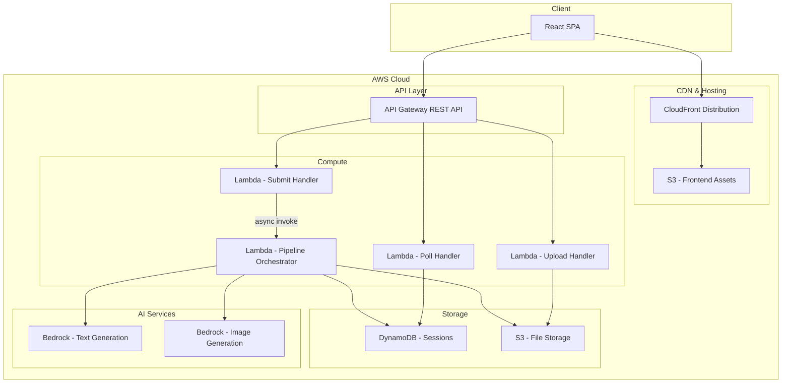
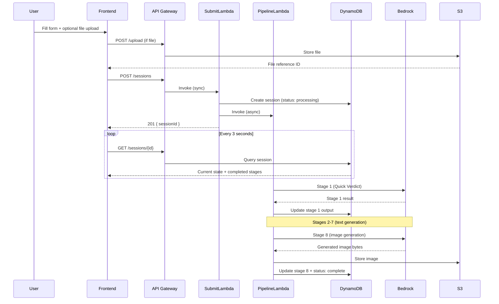

# Design Document: ReSource AI E-Waste Triage

## Overview

ReSource AI is a production AWS application that converts the existing PartyRock prototype into a scalable, safety-first e-waste triage system. Users submit device information (text descriptions and optional photo/document evidence) through a web frontend, which triggers an 8-stage AI pipeline orchestrated on the backend. Each stage builds on all prior outputs, culminating in a generated concept image.

The system uses an asynchronous request-response pattern: the frontend submits a triage request, receives a session ID, and polls for progressive results as each pipeline stage completes. This design accommodates the 120-second pipeline budget while keeping the frontend responsive.

### Key Design Decisions

1. **Async polling over WebSockets**: Simpler to implement, no persistent connection management, works behind CDN/proxies without special configuration. Polling interval of 3 seconds balances responsiveness with cost.

2. **Lambda for compute**: The 120-second pipeline budget fits within Lambda's 15-minute limit. Lambda's pay-per-use model suits the bursty, per-session workload. A single Lambda invocation runs the entire pipeline sequentially (no Step Functions overhead for 8 serial stages).

3. **API Gateway with async invocation**: The submission endpoint triggers the pipeline Lambda asynchronously and immediately returns a session ID. A separate synchronous Lambda handles polling/status requests.

4. **DynamoDB for session state**: Low-latency reads for polling, TTL for automatic cleanup, and atomic updates as each stage completes. Simpler than managing state in S3 JSON files.

5. **AWS CDK (TypeScript)**: Provides type-safe infrastructure definitions, good Bedrock/Lambda/API Gateway construct support, and single-command deployment.

6. **React SPA for frontend**: Lightweight, component-based UI that maps naturally to the 8-stage result display. Hosted on S3 + CloudFront.

## Architecture

### High-Level Architecture



### Request Flow



## Components and Interfaces

### Frontend Components

| Component | Responsibility |
|-----------|---------------|
| `TriageForm` | Renders 3 text inputs with validation, character counters, and file upload control |
| `FileUploader` | Handles file selection, size/type validation, upload to API, displays upload status |
| `ResultsView` | Container that renders stage results progressively as they arrive |
| `StageCard` | Renders a single pipeline stage output (text content with appropriate formatting) |
| `PartsMapTable` | Renders the Reusable Parts Map as a structured table |
| `ImpactCard` | Renders the ReSource Impact Card as a styled summary card |
| `ConceptImage` | Renders the generated image with loading placeholder |
| `ProgressIndicator` | Shows pipeline progress with current stage name |
| `RiskBadge` | Color-coded Risk_Level indicator (Green/Yellow/Orange/Red) |
| `PollingService` | Manages session polling lifecycle (start, interval, stop on complete/error) |

### Backend Components

| Component | Responsibility |
|-----------|---------------|
| `SubmitHandler` | Validates triage request, creates DynamoDB session, triggers pipeline async |
| `PollHandler` | Reads session state from DynamoDB, returns current results |
| `UploadHandler` | Validates file type/size, stores in S3, returns file reference |
| `PipelineOrchestrator` | Executes 8 stages sequentially, manages timeout, updates DynamoDB per stage |
| `StageExecutor` | Builds prompt for a given stage, calls Bedrock, parses response |
| `PromptBuilder` | Constructs stage-specific prompts with accumulated context |
| `InputSanitizer` | Strips/escapes injection patterns from user text inputs |
| `BedrockClient` | Wrapper around Bedrock InvokeModel for text and image generation |
| `SessionStore` | DynamoDB access layer for session CRUD and stage updates |
| `FileStore` | S3 access layer for file upload, retrieval, and pre-signed URL generation |

### API Endpoints

| Method | Path | Handler | Description |
|--------|------|---------|-------------|
| POST | `/upload` | UploadHandler | Upload device evidence file |
| POST | `/sessions` | SubmitHandler | Create new triage session |
| GET | `/sessions/{sessionId}` | PollHandler | Get session status and results |

### Interface Contracts

#### POST /upload

**Request:**
- Content-Type: `multipart/form-data`
- Body: file (max 10 MB, supported formats)

**Response (201):**
```json
{
  "fileId": "string",
  "fileName": "string",
  "contentType": "string"
}
```

**Errors:** 400 (unsupported format), 413 (size exceeded), 401 (auth failure)

#### POST /sessions

**Request:**
```json
{
  "deviceIdentity": "string (required, max 2000 chars)",
  "failureSymptoms": "string (required, max 2000 chars)",
  "userContext": "string (required, max 2000 chars)",
  "fileIds": ["string"] 
}
```

**Response (201):**
```json
{
  "sessionId": "string"
}
```

**Errors:** 400 (validation), 401 (auth failure)

#### GET /sessions/{sessionId}

**Response (200):**
```json
{
  "sessionId": "string",
  "status": "processing | complete | failed",
  "currentStage": "string | null",
  "error": {
    "stage": "string",
    "message": "string"
  } | null,
  "stages": {
    "quickVerdict": { ... } | null,
    "safetyGate": { ... } | null,
    "detailedAnalysis": { ... } | null,
    "reusablePartsMap": { ... } | null,
    "secondLifeIdeas": { ... } | null,
    "nextSteps": { ... } | null,
    "impactCard": { ... } | null,
    "conceptVisual": {
      "imageUrl": "string (pre-signed S3 URL)"
    } | null
  }
}
```

**Errors:** 404 (session not found), 401 (auth failure)

## Data Models

### DynamoDB Session Table

**Table Name:** `resource-ai-sessions`  
**Partition Key:** `sessionId` (String)  
**TTL Attribute:** `expiresAt`

```typescript
interface TriageSession {
  sessionId: string;           // UUID v4
  status: 'processing' | 'complete' | 'failed';
  currentStage: string | null; // Name of currently executing stage
  createdAt: string;           // ISO 8601 timestamp
  expiresAt: number;           // Unix epoch (TTL, 24 hours from creation)
  
  // User inputs
  inputs: {
    deviceIdentity: string;
    failureSymptoms: string;
    userContext: string;
    fileIds: string[];
  };

  // Pipeline outputs (populated progressively)
  stages: {
    quickVerdict: QuickVerdictOutput | null;
    safetyGate: SafetyGateOutput | null;
    detailedAnalysis: DetailedAnalysisOutput | null;
    reusablePartsMap: ReusablePartsMapOutput | null;
    secondLifeIdeas: SecondLifeIdeasOutput | null;
    nextSteps: NextStepsOutput | null;
    impactCard: ImpactCardOutput | null;
    conceptVisual: ConceptVisualOutput | null;
  };

  // Error info (if failed)
  error: {
    stage: string;
    message: string;
  } | null;
}
```

### Stage Output Types

```typescript
interface QuickVerdictOutput {
  deviceIdentification: string;
  confidence: 'high' | 'moderate' | 'low';
  riskLevel: 'Green' | 'Yellow' | 'Orange' | 'Red';
  salvageScore: number;        // 1-5
  bestNextStep: string;
  safetyWarning: string;
  topReusableResources: string[]; // 3-5 items
  missingInfoNotes: string;
}

interface SafetyGateOutput {
  riskLevel: 'Green' | 'Yellow' | 'Orange' | 'Red';
  identifiedHazards: string[];  // at least 1
  doNotPerform: string[];
  safeActions: string[];
  stopConditions: string[];
  recommendedSafeNextStep: string;
}

interface DetailedAnalysisOutput {
  probableDeviceIdentity: string;
  componentProfile: ComponentEntry[];
  failurePatternAnalysis: string;
  diagnosticVerdict: string;
  verdictSummary: string;       // max 30 words
}

interface ComponentEntry {
  name: string;
  function: string;
  type: 'internal' | 'external';
  conditionScore: number;       // 1-5
  requiresSupervision?: boolean;
}

interface ReusablePartsMapOutput {
  parts: PartsMapRow[];         // 6-10 rows
}

interface PartsMapRow {
  partResource: string;
  likelyPresence: 'Confirmed' | 'Probable' | 'Uncertain';
  reuseValue: 'High' | 'Medium' | 'Low' | 'None';
  possibleUse: string;
  skillNeeded: 'Beginner' | 'Intermediate' | 'Advanced' | 'Professional';
  safetyConcern: string;
  verdict: 'Salvage' | 'Conditional' | 'Do Not Access';
}

interface SecondLifeIdeasOutput {
  ideas: ProjectIdea[];         // exactly 3
}

interface ProjectIdea {
  category: 'beginner' | 'stem-learning' | 'practical-creative';
  title: string;
  description: string;          // max 90 words
  requiredComponents: string[];
  additionalMaterials: string[];
}

interface NextStepsOutput {
  safeFirstActions: string[];   // 3-5 ordered steps
  partsToKeep: string[];
  partsToAvoid: string[];
  overallRecommendation: string;
  trashWarnings: string[];
  localRecoveryNote: string;
  hazardWarnings: HazardWarning[];
}

interface HazardWarning {
  component: string;
  risk: string;
}

interface ImpactCardOutput {
  deviceName: string;
  riskLevel: string;
  salvageScore: string;
  topReusablePart: string;
  bestSecondLifeIdea: string;
  skillLevelRequired: string;
  safetyWarning: string;
  recommendedAction: string;
  environmentalImpactNote: string;
  recoveryDifficulty: string;
  overallVerdict: string;
}

interface ConceptVisualOutput {
  imageUrl: string;             // Pre-signed S3 URL (1 hour expiry)
}
```

### S3 Storage Structure

```
resource-ai-files/
├── uploads/
│   └── {sessionId}/
│       └── {fileId}.{ext}     # User-uploaded device evidence
└── generated/
    └── {sessionId}/
        └── concept-visual.png  # Generated image (1024x1024)
```

### Pipeline Stage Configuration

```typescript
const PIPELINE_STAGES = [
  { key: 'quickVerdict',      name: 'Quick ReSource Verdict',              type: 'text' },
  { key: 'safetyGate',        name: 'Safety Gate',                         type: 'text' },
  { key: 'detailedAnalysis',  name: 'Detailed Resource Analysis',          type: 'text' },
  { key: 'reusablePartsMap',  name: 'Reusable Parts Map',                  type: 'text' },
  { key: 'secondLifeIdeas',   name: 'Safe Second Life Ideas',              type: 'text' },
  { key: 'nextSteps',         name: 'Safe Next Steps and Recovery Route',  type: 'text' },
  { key: 'impactCard',        name: 'ReSource Impact Card',                type: 'text' },
  { key: 'conceptVisual',     name: 'ReSource Concept Visual',             type: 'image' },
] as const;
```


## Correctness Properties

*A property is a characteristic or behavior that should hold true across all valid executions of a system — essentially, a formal statement about what the system should do. Properties serve as the bridge between human-readable specifications and machine-verifiable correctness guarantees.*

### Property 1: Input validation rejects whitespace-only and accepts non-whitespace

*For any* string composed entirely of whitespace characters (spaces, tabs, newlines) in any of the three required text fields, the system SHALL reject the submission. Conversely, for any set of three strings each containing at least one non-whitespace character within the 2000-character limit, the system SHALL accept the submission.

**Validates: Requirements 2.5, 2.6**

### Property 2: File upload validation enforces size and count limits

*For any* file upload request, if the file exceeds 10 MB the system SHALL reject it, and for any session that already has 5 files associated, the system SHALL reject additional uploads. Files within size limits for sessions with fewer than 5 files SHALL be accepted.

**Validates: Requirements 1.2, 1.3**

### Property 3: Pipeline stages receive accumulated context

*For any* pipeline stage N (where N is 1 to 8), the prompt constructed for that stage SHALL contain all user inputs (deviceIdentity, failureSymptoms, userContext, fileIds) plus the complete outputs from all stages 1 through N-1. Stage 1 receives only user inputs.

**Validates: Requirements 3.2, 3.3**

### Property 4: Pipeline failure halts subsequent stages

*For any* stage position K (1 through 8) where stage K fails, no stages after K SHALL execute, and the session status SHALL be set to 'failed' with an error identifying stage K.

**Validates: Requirements 3.4**

### Property 5: Safety Gate output validity and fallback

*For any* Safety Gate response, the riskLevel field must be exactly one of Green, Yellow, Orange, or Red, and the response must contain at least one identified hazard. For any response missing the riskLevel field or containing an invalid value, the system SHALL default to Red.

**Validates: Requirements 5.1, 5.2, 5.5**

### Property 6: Red risk restricts all downstream stages to external-only

*For any* session where the Safety Gate assigns Risk_Level Red, all downstream stage prompts SHALL instruct the LLM to exclude internal component recommendations. Specifically: Detailed Analysis SHALL exclude internal components, Reusable Parts Map SHALL mark internal parts as "Do Not Access" with "Professional" skill, Second Life Ideas SHALL only reference externally accessible components, Next Steps SHALL exclude internal access steps, and Impact Card SHALL not recommend internal access.

**Validates: Requirements 5.3, 6.3, 7.3, 8.5, 9.4, 10.4**

### Property 7: Orange risk flags internal components as supervised

*For any* session where the Safety Gate assigns Risk_Level Orange, the Detailed Analysis SHALL flag internal components as requiring supervised handling, and the Reusable Parts Map SHALL mark internal parts with Verdict "Conditional" and a non-empty Safety Concern description.

**Validates: Requirements 6.4, 7.5**

### Property 8: Skill level constraint across stages

*For any* part in the Reusable Parts Map with Verdict "Salvage", the Skill Needed SHALL not exceed the user's stated skill level. For any Second Life Idea, the project difficulty SHALL not exceed the user's stated skill level. When no skill level is stated, the system SHALL default to beginner.

**Validates: Requirements 7.4, 8.3, 8.4**

### Property 9: Cross-stage component consistency

*For any* Second Life Idea, all referenced components SHALL exist in the Reusable Parts Map output. No idea SHALL reference a component that was not identified in the Parts Map stage.

**Validates: Requirements 8.6**

### Property 10: Recommendations comply with Safety Gate handling tier

*For any* session at a given Risk_Level, the Safe Next Steps recommendations SHALL only include actions within the permitted handling tier: Green allows external and simple internal access, Yellow allows cautious internal access, Orange allows supervised handling only, and Red allows external inspection only with professional referral.

**Validates: Requirements 9.3, 9.4**

### Property 11: Hazard warnings reference Safety Gate output

*For any* Next Steps output, the hazard warnings SHALL reference components identified in the Safety Gate's hazard list, with each warning stating the specific risk type.

**Validates: Requirements 9.5**

### Property 12: Output length constraints

*For any* Detailed Resource Analysis output, word count SHALL be ≤ 350. For any Second Life Idea description, word count SHALL be ≤ 90. For any Next Steps output, word count SHALL be ≤ 300. For any Impact Card, total field value word count SHALL be ≤ 120 and each individual field value SHALL be ≤ 15 words.

**Validates: Requirements 6.2, 8.2, 9.2, 10.2, 10.3**

### Property 13: Image concept reflects Safety Gate risk level

*For any* session, the image generation prompt SHALL depict the safest second-life project when Risk_Level is Green, Yellow, or Orange, and SHALL depict a professional recovery/recycling concept when Risk_Level is Red.

**Validates: Requirements 11.2, 11.3**

### Property 14: Input sanitization removes injection patterns

*For any* user text input containing SQL metacharacters, HTML/script tags, or prompt injection sequences, the sanitized output SHALL not contain those dangerous patterns while preserving the semantic content of the input.

**Validates: Requirements 15.7**

### Property 15: Input length enforcement

*For any* user text input exceeding 5000 characters, the Backend_API SHALL reject the request with an error indicating the length limit was exceeded.

**Validates: Requirements 15.8**

### Property 16: Authentication enforcement

*For any* API request lacking a valid API key or Cognito token, the Backend_API SHALL reject the request with an authentication error and SHALL NOT process the request body or trigger any pipeline execution.

**Validates: Requirements 15.1, 15.2**

### Property 17: API error responses include descriptive error body

*For any* API request that results in an error (4xx or 5xx), the response SHALL include a body containing an error description. Specifically: 400 for validation errors, 404 for non-existent sessions, 413 for oversized files, and 500 for internal errors.

**Validates: Requirements 13.4, 13.5, 13.7**

### Property 18: Request schema validation

*For any* incoming request payload that does not conform to the expected schema (wrong field types, missing required fields, or character limits exceeded), the Backend_API SHALL reject the request with a 400 status code before any processing occurs.

**Validates: Requirements 13.6**

### Property 19: Conservative risk escalation with insufficient evidence

*For any* triage request where no Device_Evidence files are provided and any required text field contains fewer than 50 characters, the Quick Verdict stage SHALL assign a Risk_Level one tier more conservative than the evidence suggests (Green→Yellow, Yellow→Orange, Orange→Red), defaulting to Red when no evidence supports a classification.

**Validates: Requirements 4.3**

### Property 20: Poll response accurately reflects session state

*For any* session in state S (processing, complete, or failed), a GET request for that session SHALL return a response with status matching S, currentStage matching the active stage (or null if complete/failed), and all completed stage outputs present.

**Validates: Requirements 3.7**

## Error Handling

### Error Categories

| Category | HTTP Code | Handling Strategy |
|----------|-----------|-------------------|
| Validation Error | 400 | Return immediately with field-specific error message |
| Authentication Failure | 401 | Reject before processing, return auth error |
| Session Not Found | 404 | Return not-found error for invalid session IDs |
| File Too Large | 413 | Reject upload, return size limit message |
| Pipeline Stage Failure | 500 | Halt pipeline, record failed stage in session, return error on poll |
| Pipeline Timeout | 500 | Abort remaining stages, record timeout in session |
| Bedrock Service Error | 500 | Retry once with exponential backoff, then fail the stage |
| S3 Unavailable | 500 | Return upload error without failing the session |
| Image Generation Failure | — | Record placeholder in session, mark pipeline as complete |

### Retry Strategy

- **Bedrock InvokeModel**: Retry once after 2-second delay on transient errors (throttling, service unavailable)
- **DynamoDB writes**: Retry up to 3 times with exponential backoff (100ms, 200ms, 400ms)
- **S3 operations**: No retry for uploads (user can retry manually); retry once for generated image storage

### Timeout Management

```typescript
const PIPELINE_TIMEOUT_MS = 120_000;
const STAGE_SOFT_TIMEOUT_MS = 30_000; // Per-stage soft limit for monitoring
const BEDROCK_REQUEST_TIMEOUT_MS = 60_000; // Individual Bedrock call timeout

async function executePipeline(session: TriageSession): Promise<void> {
  const startTime = Date.now();
  
  for (const stage of PIPELINE_STAGES) {
    const elapsed = Date.now() - startTime;
    if (elapsed >= PIPELINE_TIMEOUT_MS) {
      await markSessionTimeout(session.sessionId, stage.name);
      return;
    }
    
    try {
      const result = await executeStage(stage, session, PIPELINE_TIMEOUT_MS - elapsed);
      await updateSessionStage(session.sessionId, stage.key, result);
    } catch (error) {
      await markSessionFailed(session.sessionId, stage.name, error.message);
      return;
    }
  }
  
  await markSessionComplete(session.sessionId);
}
```

### Error Response Format

```json
{
  "error": {
    "code": "VALIDATION_ERROR | AUTH_FAILURE | NOT_FOUND | SIZE_EXCEEDED | INTERNAL_ERROR",
    "message": "Human-readable description of what went wrong",
    "field": "optional - which field caused the error"
  }
}
```

## Testing Strategy

### Unit Tests

Unit tests cover specific examples, edge cases, and component behavior:

- **InputSanitizer**: Test specific injection patterns (SQL, XSS, prompt injection) are neutralized
- **PromptBuilder**: Test prompt construction for each stage with known inputs produces expected structure
- **Validation logic**: Test boundary cases (exactly 2000 chars, exactly 10 MB, exactly 5 files)
- **Risk escalation logic**: Test specific scenarios for conservative risk assignment
- **Session state machine**: Test valid state transitions (processing → complete, processing → failed)
- **Error response formatting**: Test each error code produces correct HTTP status and body shape

### Property-Based Tests

Property-based tests verify universal properties across randomized inputs. Each property test runs a minimum of 100 iterations.

**Library**: [fast-check](https://github.com/dubzzz/fast-check) (TypeScript property-based testing)

**Configuration**: Each test tagged with feature and property reference:
```typescript
// Feature: resource-ai-ewaste-triage, Property 1: Input validation rejects whitespace-only and accepts non-whitespace
```

**Properties to implement:**
1. Input validation (whitespace rejection, valid acceptance)
2. File upload validation (size + count limits)
3. Accumulated context in pipeline stages
4. Pipeline failure halts execution
5. Safety Gate output validity and Red fallback
6. Red risk downstream restriction
7. Orange risk supervision flagging
8. Skill level constraints
9. Cross-stage component consistency
10. Safety tier compliance in recommendations
11. Output length constraints
12. Input sanitization
13. Input length enforcement
14. Authentication enforcement
15. API error response format
16. Request schema validation
17. Conservative risk escalation
18. Poll response accuracy
19. Image concept risk-level alignment
20. Hazard warning cross-reference

### Integration Tests

- **End-to-end pipeline**: Submit a triage request with known inputs, verify all 8 stages complete
- **File upload flow**: Upload file → submit session referencing file → verify file accessible in pipeline
- **Timeout behavior**: Mock slow Bedrock responses, verify 120-second abort
- **S3 failure resilience**: Mock S3 unavailability during upload, verify graceful error
- **Image generation failure**: Mock Bedrock image failure, verify session completes with placeholder
- **Authentication**: Verify requests without valid tokens are rejected at API Gateway level
- **HTTPS enforcement**: Verify HTTP connections are refused

### Infrastructure Tests

- **CDK snapshot tests**: Verify synthesized CloudFormation matches expected resource configuration
- **IAM policy validation**: Verify no wildcard resource ARNs, minimal permissions
- **S3 bucket policy**: Verify public access blocked, encryption enabled, lifecycle policy set
- **API Gateway configuration**: Verify HTTPS-only, correct integration timeouts

### Test Execution

```bash
# Unit + property tests
npm test

# Integration tests (requires deployed stack)
npm run test:integration

# CDK snapshot tests
npm run test:infra
```
