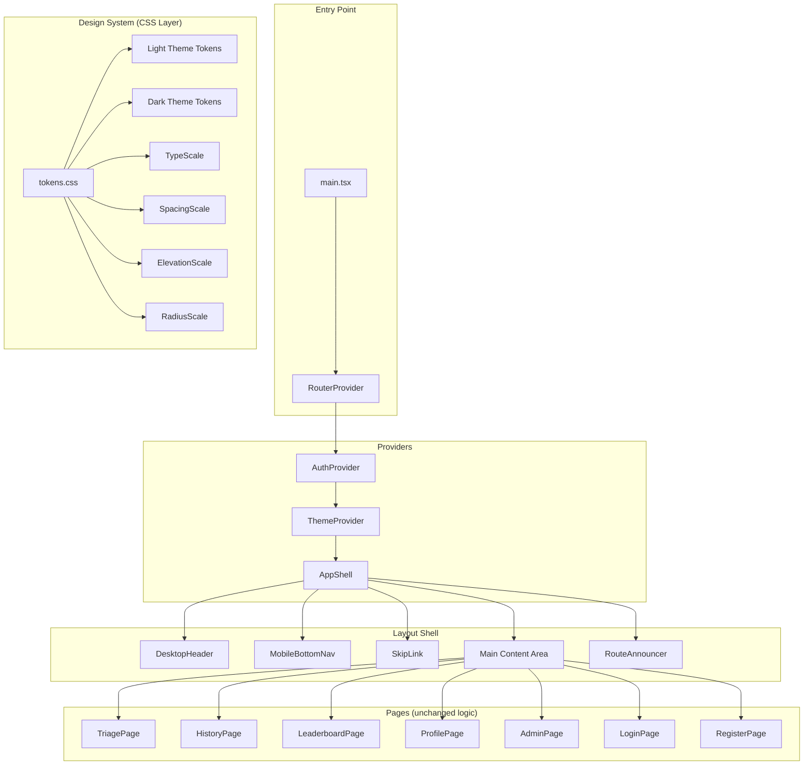
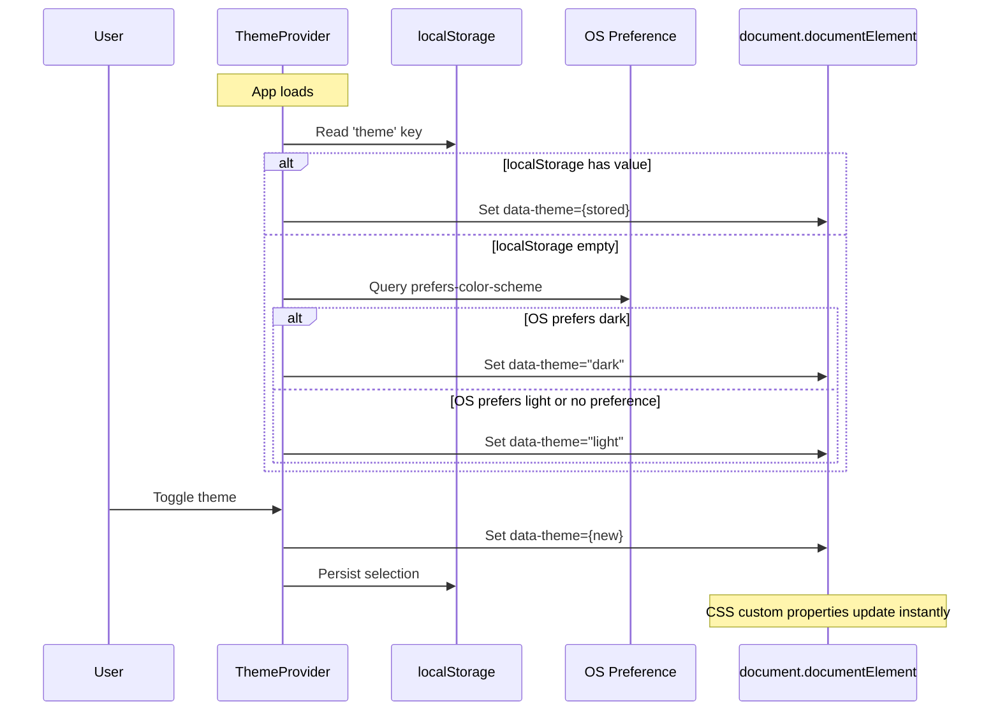

# Design Document: UI/UX Revamp

## Overview

This design replaces the current dark-only glassmorphism aesthetic (animated gradients, floating particles, glow effects, backdrop-blur cards) with a clean, professional design system inspired by Linear, Vercel, and Stripe. The revamp introduces a centralized token-based design system, light/dark theme support, redesigned navigation, and consistent component patterns — while preserving all existing functionality, routes, and data flows unchanged.

The approach is a **visual layer replacement**: every page keeps its existing logic, API calls, and state management. Only the presentation components, CSS, and layout shell change.

### Key Design Decisions

1. **CSS Custom Properties + Tailwind v4 `@theme`** for token management — enables runtime theme switching without JS-driven class toggling on every element.
2. **`data-theme` attribute on `<html>`** for theme scoping — simpler than class-based toggling and works with CSS `:has()` or attribute selectors.
3. **Single `ThemeProvider` context** wrapping the app — manages preference resolution, persistence, and exposes toggle API.
4. **Layout shell refactor** — `App.tsx` becomes a thin shell delegating to `AppShell` which handles header (desktop) and bottom nav (mobile).
5. **Incremental migration** — existing components can be updated page-by-page since tokens are global CSS custom properties.

---

## Architecture



### Theme Resolution Flow



---

## Components and Interfaces

### ThemeProvider

```typescript
// src/contexts/ThemeContext.tsx

type Theme = 'light' | 'dark';

interface ThemeContextValue {
  theme: Theme;
  toggleTheme: () => void;
  setTheme: (theme: Theme) => void;
}

function ThemeProvider({ children }: { children: ReactNode }): JSX.Element;
function useTheme(): ThemeContextValue;
```

**Behavior:**
- On mount: resolve theme from localStorage → OS preference → 'light' fallback
- `toggleTheme()`: flips current theme, updates `data-theme` attribute, persists to localStorage
- `setTheme()`: sets explicit theme value
- If localStorage write fails, theme still applies for current session (no error shown)
- Applies `data-theme` attribute to `document.documentElement` for CSS scoping

### AppShell

```typescript
// src/components/layout/AppShell.tsx

interface AppShellProps {
  children: ReactNode;
}

function AppShell({ children }: AppShellProps): JSX.Element;
```

**Responsibilities:**
- Renders `<SkipLink>` as first focusable element
- Renders `<DesktopHeader>` (hidden below 768px)
- Renders `<main>` with max-w-6xl, centered, responsive padding
- Renders `<MobileBottomNav>` (hidden at 768px+)
- Renders `<RouteAnnouncer>` for screen reader page change announcements
- Applies bottom padding on mobile to account for fixed bottom nav

### DesktopHeader

```typescript
// src/components/layout/DesktopHeader.tsx

function DesktopHeader(): JSX.Element;
```

**Contains:**
- Logo (ReSource AI branding — simplified, no glow/animation)
- Horizontal nav links with icon + text label (Triage, History, Leaderboard, Admin if manager)
- Active item highlighted with primary color background treatment
- Theme toggle button (Sun/Moon icon)
- User profile dropdown (avatar, name, level badge, logout)

### MobileBottomNav

```typescript
// src/components/layout/MobileBottomNav.tsx

function MobileBottomNav(): JSX.Element;
```

**Contains:**
- Fixed to bottom of viewport
- Max 5 items: Triage, History, Leaderboard, Profile, (Admin if manager — replaces Profile for managers)
- Each item: icon + text label, 44×44px minimum touch target
- Active item highlighted with primary color
- Safe area padding for devices with home indicators

### RouteAnnouncer

```typescript
// src/components/layout/RouteAnnouncer.tsx

function RouteAnnouncer(): JSX.Element;
```

**Behavior:**
- Listens to route changes via React Router
- Updates an `aria-live="polite"` region with the new page title
- Moves focus to `<main>` or page heading on navigation

### SkipLink

```typescript
// src/components/layout/SkipLink.tsx

function SkipLink(): JSX.Element;
```

- Visually hidden by default, visible on focus
- Links to `#main-content`
- First focusable element in DOM

### ThemeToggle

```typescript
// src/components/ui/ThemeToggle.tsx

function ThemeToggle(): JSX.Element;
```

- Renders Sun icon (light mode active) or Moon icon (dark mode active)
- `aria-label="Switch to dark theme"` / `"Switch to light theme"`
- Keyboard operable (Enter/Space)
- 44×44px touch target

### Button

```typescript
// src/components/ui/Button.tsx

interface ButtonProps extends React.ButtonHTMLAttributes<HTMLButtonElement> {
  variant?: 'primary' | 'secondary' | 'destructive';
  size?: 'sm' | 'md' | 'lg';
  isLoading?: boolean;
  leftIcon?: React.ReactNode;
  rightIcon?: React.ReactNode;
}

function Button(props: ButtonProps): JSX.Element;
```

**States:** default, hover, active (scale 0.97), focus (ring), disabled (opacity 0.5)

### Card

```typescript
// src/components/ui/Card.tsx

interface CardProps {
  children: ReactNode;
  elevation?: 'sm' | 'md' | 'lg';
  className?: string;
}

function Card({ children, elevation = 'md', className }: CardProps): JSX.Element;
```

- Solid background using `--color-surface-card`
- Border using `--color-border-default`
- Border-radius from scale (lg: 12px)
- Box-shadow from elevation scale

### Input

```typescript
// src/components/ui/Input.tsx

interface InputProps extends React.InputHTMLAttributes<HTMLInputElement> {
  label: string;
  error?: string;
  helperText?: string;
}

function Input(props: InputProps): JSX.Element;
```

- Visible label above field (never placeholder-only)
- 1px border using `--color-border-default`
- Focus: 2px ring using primary color
- Error: red border + error message below field

### Skeleton

```typescript
// src/components/ui/Skeleton.tsx

interface SkeletonProps {
  variant?: 'text' | 'circular' | 'rectangular';
  width?: string | number;
  height?: string | number;
  className?: string;
}

function Skeleton(props: SkeletonProps): JSX.Element;
```

- Animated pulse using opacity (not background-position for performance)
- Respects `prefers-reduced-motion` (static gray block instead)

---

## Data Models

### Design Token Structure

```typescript
// src/design-system/tokens.ts

interface ColorTokens {
  surface: string;
  'surface-elevated': string;
  'surface-card': string;
  'border-default': string;
  'border-subtle': string;
  'text-primary': string;
  'text-secondary': string;
  'text-muted': string;
  primary: string;
  'primary-hover': string;
  error: string;
  success: string;
  warning: string;
}

interface ThemeTokens {
  light: ColorTokens;
  dark: ColorTokens;
}

interface TypeScaleEntry {
  size: number;       // px
  lineHeight: number; // unitless ratio
  weight: number;     // font-weight
  role: string;       // semantic role name
}

interface SpacingScale {
  [key: string]: number; // e.g., '1': 4, '2': 8, '3': 12, ...
}

interface ElevationScale {
  sm: string;  // box-shadow value
  md: string;
  lg: string;
}

interface RadiusScale {
  sm: number;  // 6px
  md: number;  // 8px
  lg: number;  // 12px
}
```

### Theme Token Values

**Light Theme:**
| Token | Value | Usage |
|-------|-------|-------|
| surface | `#ffffff` | Page background |
| surface-elevated | `#f8fafc` | Elevated sections |
| surface-card | `#ffffff` | Card backgrounds |
| border-default | `#e2e8f0` | Standard borders |
| border-subtle | `#f1f5f9` | Subtle dividers |
| text-primary | `#0f172a` | Headings, primary text |
| text-secondary | `#475569` | Secondary body text |
| text-muted | `#94a3b8` | Captions, metadata |
| primary | `#4f46e5` | Primary actions, links |
| primary-hover | `#4338ca` | Primary hover state |
| error | `#dc2626` | Error states |
| success | `#16a34a` | Success states |
| warning | `#d97706` | Warning states |

**Dark Theme:**
| Token | Value | Usage |
|-------|-------|-------|
| surface | `#09090b` | Page background |
| surface-elevated | `#18181b` | Elevated sections |
| surface-card | `#1c1c22` | Card backgrounds |
| border-default | `#27272a` | Standard borders |
| border-subtle | `#1f1f23` | Subtle dividers |
| text-primary | `#fafafa` | Headings, primary text |
| text-secondary | `#a1a1aa` | Secondary body text |
| text-muted | `#71717a` | Captions, metadata |
| primary | `#818cf8` | Primary actions (desaturated) |
| primary-hover | `#a5b4fc` | Primary hover state |
| error | `#f87171` | Error states (desaturated) |
| success | `#4ade80` | Success states (desaturated) |
| warning | `#fbbf24` | Warning states (desaturated) |

### Navigation Items Model

```typescript
interface NavItem {
  path: string;
  label: string;
  icon: LucideIcon;
  requiresAuth: boolean;
  requiresManager?: boolean;
}

const NAV_ITEMS: NavItem[] = [
  { path: '/', label: 'Triage', icon: Leaf, requiresAuth: true },
  { path: '/history', label: 'History', icon: History, requiresAuth: true },
  { path: '/leaderboard', label: 'Leaderboard', icon: Trophy, requiresAuth: true },
  { path: '/profile', label: 'Profile', icon: User, requiresAuth: true },
  { path: '/admin', label: 'Admin', icon: Shield, requiresAuth: true, requiresManager: true },
];
```

---

## Correctness Properties

*A property is a characteristic or behavior that should hold true across all valid executions of a system — essentially, a formal statement about what the system should do. Properties serve as the bridge between human-readable specifications and machine-verifiable correctness guarantees.*

### Property 1: Theme Resolution Priority

*For any* combination of localStorage state (present with 'light', present with 'dark', or absent) and OS color scheme preference (light, dark, or no-preference), the ThemeProvider SHALL resolve the active theme following strict priority: (1) localStorage value if present and valid, (2) OS preference if detectable, (3) 'light' as default fallback.

**Validates: Requirements 2.2**

### Property 2: Theme Persistence Round-Trip

*For any* valid theme value ('light' or 'dark'), when the user selects that theme, reading the persisted value from localStorage SHALL return the same theme value that was selected.

**Validates: Requirements 2.3**

### Property 3: WCAG AA Contrast Compliance

*For any* theme (light or dark) and *for any* text/background semantic token pair where the text token is one of (text-primary, text-secondary, text-muted) and the background token is one of (surface, surface-elevated, surface-card), the computed contrast ratio SHALL be at least 4.5:1 for normal text (below 18px) and at least 3:1 for large text (18px+ or 14px bold+).

**Validates: Requirements 2.6, 2.7, 10.1**

### Property 4: Active Navigation Highlighting

*For any* valid route path that corresponds to a navigation item, rendering the Navigation_Shell at that route SHALL highlight exactly one navigation item (the matching one) with the primary color treatment, and all other items SHALL be in their inactive state.

**Validates: Requirements 4.3, 4.9**

### Property 5: Button Variant State Distinctness

*For any* button variant (primary, secondary, destructive) and *for any* pair of adjacent states (default→hover, hover→active, default→disabled), the computed styles SHALL differ by at least one of: background-color, border-color, or opacity value.

**Validates: Requirements 7.1**

### Property 6: Badge and Tag Contrast Compliance

*For any* badge or tag component rendered in either theme, the foreground text color and background color pair SHALL meet WCAG AA contrast ratio of 4.5:1 for normal text and 3:1 for large text.

**Validates: Requirements 7.6**

### Property 7: Modal Focus Trap

*For any* open modal or overlay component, keyboard focus SHALL be trapped within the modal (Tab and Shift+Tab cycle through modal-internal focusable elements only), the Escape key SHALL dismiss the modal, and upon dismissal focus SHALL return to the element that triggered the modal.

**Validates: Requirements 10.10**

### Property 8: Protected Route Redirect Preservation

*For any* protected route path, when an unauthenticated user attempts to access it, the system SHALL redirect to `/login` and preserve the originally requested path such that successful authentication redirects the user back to that exact path.

**Validates: Requirements 11.7**

---

## Error Handling

### Theme System Errors

| Scenario | Handling |
|----------|----------|
| localStorage unavailable (private browsing, quota exceeded) | Theme applies for current session; no persistence; no error shown to user |
| Invalid value in localStorage `theme` key | Treat as absent; fall through to OS preference → default |
| `matchMedia` not supported | Fall through to 'light' default |

### Navigation Errors

| Scenario | Handling |
|----------|----------|
| Route not found | React Router's default 404 handling (existing behavior preserved) |
| Navigation during async operation | Operation continues in background; no interruption |

### Component Rendering Errors

| Scenario | Handling |
|----------|----------|
| Data loading > 300ms | Show skeleton screen matching expected content layout |
| Network request failure | Show error state with icon, message identifying failure type, and retry button |
| Retry failure | Keep error state visible with retry button available for subsequent attempts |
| Empty data state | Show illustrative icon + message + CTA directing to next step |

### Accessibility Error States

| Scenario | Handling |
|----------|----------|
| Async operation success | Announce via `aria-live="polite"` region |
| Async operation failure | Announce via `aria-live="assertive"` region |
| Form validation failure | Display error below field; programmatically focus first invalid field |

---

## Testing Strategy

### Unit Tests (Example-Based)

Unit tests cover specific scenarios, static configuration checks, and UI presence verification:

- **Token completeness**: Verify all required semantic tokens exist for both themes
- **Type scale**: Verify sizes, line-heights, and role mappings match spec
- **Spacing scale**: Verify all values are multiples of 4px
- **Component rendering**: Verify Header renders at desktop, BottomNav renders at mobile
- **Skip link**: Verify it's first focusable element and targets `#main-content`
- **Theme toggle**: Verify it renders with correct aria-label for current state
- **Decorative removal**: Verify no ParticlesBackground, bg-gradient-animated, glow-*, or glass-card in rendered output
- **Skeleton screens**: Verify they appear after 300ms loading delay
- **Empty states**: Verify icon + message + CTA structure
- **Form validation**: Verify error placement and focus behavior
- **Route preservation**: Verify all existing routes remain in router config
- **Semantic HTML**: Verify nav, main, header, section elements present

### Property-Based Tests

Property-based tests verify universal properties across generated inputs. Library: **fast-check** (TypeScript PBT library).

Each property test runs a minimum of **100 iterations**.

| Property | Test Description | Tag |
|----------|-----------------|-----|
| 1 | Generate random (localStorage, OS pref) combos → verify resolution | Feature: ui-ux-revamp, Property 1: Theme resolution priority |
| 2 | Generate random theme selections → verify localStorage round-trip | Feature: ui-ux-revamp, Property 2: Theme persistence round-trip |
| 3 | Generate all text/bg token pairs × both themes → verify contrast ≥ 4.5:1 | Feature: ui-ux-revamp, Property 3: WCAG AA contrast compliance |
| 4 | Generate random valid route paths → verify exactly one nav item highlighted | Feature: ui-ux-revamp, Property 4: Active navigation highlighting |
| 5 | Generate all (variant, state-pair) combos → verify style difference | Feature: ui-ux-revamp, Property 5: Button variant state distinctness |
| 6 | Generate badge/tag instances in both themes → verify contrast | Feature: ui-ux-revamp, Property 6: Badge and tag contrast compliance |
| 7 | Generate modal open scenarios → verify focus trap + Escape + focus return | Feature: ui-ux-revamp, Property 7: Modal focus trap |
| 8 | Generate random protected route paths → verify redirect + path preservation | Feature: ui-ux-revamp, Property 8: Protected route redirect preservation |

### Integration Tests

- **Theme switching**: Toggle theme and verify all visible elements update without page reload
- **Scroll restoration**: Navigate between pages and verify scroll position preserved on back
- **Responsive layout**: Render at 320px, 375px, 768px, 1024px, 1440px — verify no horizontal overflow
- **Authentication flows**: Login, register, protected route redirect — all unchanged
- **API data flows**: Triage submission, history loading, leaderboard fetch — all unchanged
- **Keyboard navigation**: Tab through entire page and verify logical order with visible focus rings

### Smoke Tests

- **Font loading**: Verify Inter loads with font-display: swap
- **Viewport meta**: Verify correct meta tag in index.html
- **Route config**: Verify all specified paths exist in router
- **Build**: Verify `tsc -b && vite build` succeeds without errors

---

## File Structure

```
frontend/src/
├── design-system/
│   ├── tokens.css              # CSS custom properties for both themes
│   ├── tokens.ts               # TypeScript token type definitions (for tests)
│   ├── typography.css           # Type scale utilities
│   └── animations.css           # Motion system (durations, easings)
├── components/
│   ├── layout/
│   │   ├── AppShell.tsx         # Main layout wrapper
│   │   ├── DesktopHeader.tsx    # Top nav for ≥768px
│   │   ├── MobileBottomNav.tsx  # Bottom nav for <768px
│   │   ├── SkipLink.tsx         # Skip to main content
│   │   └── RouteAnnouncer.tsx   # ARIA live region for route changes
│   ├── ui/
│   │   ├── Button.tsx           # Button component (3 variants)
│   │   ├── Card.tsx             # Card with elevation
│   │   ├── Input.tsx            # Input with label + error
│   │   ├── Skeleton.tsx         # Loading skeleton
│   │   ├── Badge.tsx            # Badge/tag component
│   │   ├── ThemeToggle.tsx      # Sun/Moon toggle
│   │   ├── EmptyState.tsx       # Reusable empty state
│   │   └── ErrorState.tsx       # Reusable error state with retry
│   ├── auth/                    # (unchanged)
│   ├── gamification/            # (unchanged)
│   └── ... (existing components — visual updates only)
├── contexts/
│   ├── AuthContext.tsx           # (unchanged)
│   └── ThemeContext.tsx          # NEW: Theme provider
├── hooks/
│   ├── useTriageSession.ts      # (unchanged)
│   └── useScrollRestoration.ts  # NEW: Scroll position management
├── pages/                       # (all pages — logic unchanged, visual refresh)
├── services/                    # (unchanged)
├── utils/                       # (unchanged)
├── App.tsx                      # Simplified: ThemeProvider + AppShell + Outlet
├── index.css                    # Imports tokens.css + tailwind + typography + animations
├── main.tsx                     # (unchanged)
└── router.tsx                   # (unchanged)
```

### CSS Architecture

The `index.css` file is restructured to:

1. **Import Tailwind** (`@import "tailwindcss"`)
2. **Import design tokens** (`@import "./design-system/tokens.css"`)
3. **Import typography** (`@import "./design-system/typography.css"`)
4. **Import animations** (`@import "./design-system/animations.css"`)

The `tokens.css` file uses Tailwind v4's `@theme` directive scoped by `[data-theme]`:

```css
/* Base/shared tokens */
@theme {
  --color-primary-50: #eef2ff;
  --color-primary-100: #e0e7ff;
  /* ... palette colors shared across themes ... */
}

/* Light theme (default) */
:root, [data-theme="light"] {
  --color-surface: #ffffff;
  --color-surface-elevated: #f8fafc;
  --color-surface-card: #ffffff;
  --color-border-default: #e2e8f0;
  --color-border-subtle: #f1f5f9;
  --color-text-primary: #0f172a;
  --color-text-secondary: #475569;
  --color-text-muted: #94a3b8;
  --color-primary: #4f46e5;
  --color-primary-hover: #4338ca;
  --color-error: #dc2626;
  --color-success: #16a34a;
  --color-warning: #d97706;
}

/* Dark theme */
[data-theme="dark"] {
  --color-surface: #09090b;
  --color-surface-elevated: #18181b;
  --color-surface-card: #1c1c22;
  --color-border-default: #27272a;
  --color-border-subtle: #1f1f23;
  --color-text-primary: #fafafa;
  --color-text-secondary: #a1a1aa;
  --color-text-muted: #71717a;
  --color-primary: #818cf8;
  --color-primary-hover: #a5b4fc;
  --color-error: #f87171;
  --color-success: #4ade80;
  --color-warning: #fbbf24;
}
```

### Migration Strategy

1. **Phase 1**: Add `tokens.css`, `ThemeContext`, and `AppShell` alongside existing code
2. **Phase 2**: Update `App.tsx` to use new shell (remove ParticlesBackground, bg-gradient-animated)
3. **Phase 3**: Update pages one-by-one to use new tokens and components (replace glass-card, glow-*, emoji icons)
4. **Phase 4**: Remove deprecated CSS classes and old components
5. **Phase 5**: Add property-based tests and integration tests

Each phase produces a working application — no big-bang migration.
