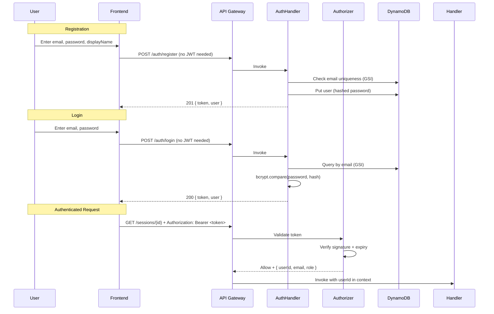
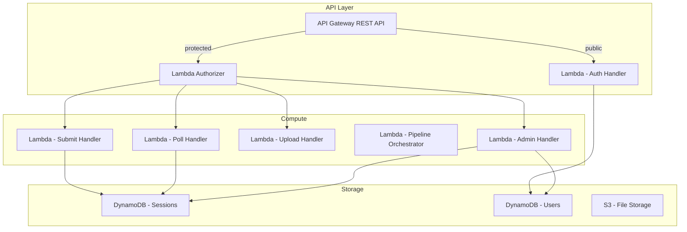

# Design Document: User Profiles & JWT Authentication

## Overview

This feature adds a custom JWT-based authentication layer to ReSource AI, replacing the need for Amazon Cognito. Users register with email/password, receive a JWT on login, and present it on every subsequent request. A Lambda Authorizer validates the token at the API Gateway level before requests reach handlers.

The design adds a `resource-ai-users` DynamoDB table, two public auth endpoints (register/login), a Lambda Authorizer, profile management endpoints, and admin endpoints for the manager role. Existing session handlers are updated to scope data by userId.

### Key Design Decisions

1. **JWT over session tokens**: Stateless validation — no DynamoDB read per request. The Lambda Authorizer decodes and verifies the token in-memory. Tradeoff: tokens can't be revoked until expiry (24h), which is acceptable for this app's risk profile.

2. **bcrypt for password hashing**: Industry standard, resistant to brute-force via configurable cost factor. We use cost 10 (good balance of security vs Lambda cold-start time).

3. **Lambda Authorizer over request-level validation**: Centralizes auth logic, keeps handler code clean, and API Gateway caches authorizer results for identical tokens (reducing Lambda invocations).

4. **JWT secret in environment variable**: Simplest approach within sandbox constraints. For production, this would move to AWS Secrets Manager or SSM SecureString. The secret is set via CDK context at deploy time.

5. **Dual auth (API key + JWT)**: API key remains as a coarse-grained gate (prevents random internet traffic). JWT provides user identity. Both are required for protected endpoints.

6. **GSI on email for login**: DynamoDB requires a key lookup for login. Since userId is the PK (for profile lookups and foreign keys), we add a GSI on email to support login queries without a scan.

## Architecture

### Authentication Flow



### Updated Architecture Diagram



## Components and Interfaces

### New Backend Components

| Component | Responsibility |
|-----------|---------------|
| `AuthHandler` | Handles POST /auth/register, POST /auth/login, GET /auth/profile, PUT /auth/profile |
| `AdminHandler` | Handles GET /admin/users, PUT /admin/users/{userId}/role, GET /admin/sessions |
| `LambdaAuthorizer` | Validates JWT, extracts user claims, returns IAM policy |
| `UserStore` | DynamoDB access layer for user CRUD (create, getByEmail, getById, update, list) |
| `JwtService` | Token generation (sign) and validation (verify) using jsonwebtoken library |
| `PasswordService` | bcrypt hash and compare operations |

### New API Endpoints

| Method | Path | Auth Required | Handler | Description |
|--------|------|---------------|---------|-------------|
| POST | `/auth/register` | No (public) | AuthHandler | Create new user account |
| POST | `/auth/login` | No (public) | AuthHandler | Authenticate and get JWT |
| GET | `/auth/profile` | Yes | AuthHandler | Get current user profile |
| PUT | `/auth/profile` | Yes | AuthHandler | Update display name |
| GET | `/admin/users` | Yes (manager) | AdminHandler | List all users |
| PUT | `/admin/users/{userId}/role` | Yes (manager) | AdminHandler | Change user role |
| GET | `/admin/sessions` | Yes (manager) | AdminHandler | List all sessions |

### Modified Existing Components

| Component | Change |
|-----------|--------|
| `SubmitHandler` | Extract userId from authorizer context, store in session |
| `PollHandler` | Check session ownership (userId match or manager role) |
| `UploadHandler` | Extract userId from authorizer context for audit |
| Sessions DynamoDB Table | Add userId attribute + GSI |

## Data Models

### Users DynamoDB Table

**Table Name:** `resource-ai-users`
**Partition Key:** `userId` (String)
**GSI:** `email-index` — Partition Key: `email` (String)

```typescript
interface User {
  userId: string;          // UUID v4
  email: string;           // Unique, lowercase, trimmed
  passwordHash: string;    // bcrypt hash (cost 10)
  displayName: string;     // 1-100 characters
  role: 'user' | 'manager';
  createdAt: string;       // ISO 8601
  updatedAt: string;       // ISO 8601
}

// Response shape (never includes passwordHash)
interface UserProfile {
  userId: string;
  email: string;
  displayName: string;
  role: 'user' | 'manager';
  createdAt: string;
}
```

### JWT Payload

```typescript
interface JwtPayload {
  userId: string;
  email: string;
  role: 'user' | 'manager';
  iat: number;    // Issued at (Unix timestamp)
  exp: number;    // Expires at (iat + 24 hours)
}
```

### Sessions Table Update

Add to existing `resource-ai-sessions` table:

```typescript
// New attribute on TriageSession
interface TriageSession {
  // ... existing fields ...
  userId: string;  // FK to users table
}
```

**New GSI:** `userId-index` — Partition Key: `userId` (String), Sort Key: `createdAt` (String)

### Interface Contracts

#### POST /auth/register

**Request:**
```json
{
  "email": "user@example.com",
  "password": "securepass123",
  "displayName": "Jane Doe"
}
```

**Response (201):**
```json
{
  "token": "eyJhbGciOiJIUzI1NiIs...",
  "user": {
    "userId": "uuid-v4",
    "email": "user@example.com",
    "displayName": "Jane Doe",
    "role": "user",
    "createdAt": "2025-01-15T10:30:00Z"
  }
}
```

**Errors:** 400 (validation), 409 (email exists)

#### POST /auth/login

**Request:**
```json
{
  "email": "user@example.com",
  "password": "securepass123"
}
```

**Response (200):**
```json
{
  "token": "eyJhbGciOiJIUzI1NiIs...",
  "user": {
    "userId": "uuid-v4",
    "email": "user@example.com",
    "displayName": "Jane Doe",
    "role": "user",
    "createdAt": "2025-01-15T10:30:00Z"
  }
}
```

**Errors:** 401 (invalid credentials)

#### GET /auth/profile

**Headers:** `Authorization: Bearer <token>`

**Response (200):**
```json
{
  "userId": "uuid-v4",
  "email": "user@example.com",
  "displayName": "Jane Doe",
  "role": "user",
  "createdAt": "2025-01-15T10:30:00Z"
}
```

#### PUT /auth/profile

**Headers:** `Authorization: Bearer <token>`

**Request:**
```json
{
  "displayName": "Jane Smith"
}
```

**Response (200):**
```json
{
  "userId": "uuid-v4",
  "email": "user@example.com",
  "displayName": "Jane Smith",
  "role": "user",
  "createdAt": "2025-01-15T10:30:00Z"
}
```

**Errors:** 400 (validation)

#### GET /admin/users

**Headers:** `Authorization: Bearer <token>` (manager role required)
**Query Params:** `?limit=50&offset=0`

**Response (200):**
```json
{
  "users": [
    {
      "userId": "uuid-v4",
      "email": "user@example.com",
      "displayName": "Jane Doe",
      "role": "user",
      "createdAt": "2025-01-15T10:30:00Z"
    }
  ],
  "total": 42,
  "limit": 50,
  "offset": 0
}
```

**Errors:** 403 (not a manager)

#### PUT /admin/users/{userId}/role

**Headers:** `Authorization: Bearer <token>` (manager role required)

**Request:**
```json
{
  "role": "manager"
}
```

**Response (200):**
```json
{
  "userId": "uuid-v4",
  "email": "user@example.com",
  "displayName": "Jane Doe",
  "role": "manager",
  "createdAt": "2025-01-15T10:30:00Z"
}
```

**Errors:** 403 (not a manager), 404 (user not found), 400 (invalid role)

#### GET /admin/sessions

**Headers:** `Authorization: Bearer <token>` (manager role required)
**Query Params:** `?limit=50&offset=0&userId=optional-filter`

**Response (200):**
```json
{
  "sessions": [
    {
      "sessionId": "uuid-v4",
      "userId": "uuid-v4",
      "status": "complete",
      "createdAt": "2025-01-15T10:30:00Z",
      "currentStage": null
    }
  ],
  "total": 100,
  "limit": 50,
  "offset": 0
}
```

**Errors:** 403 (not a manager)

## Lambda Authorizer Design

```typescript
// authorizer.ts
import jwt from 'jsonwebtoken';

interface AuthorizerEvent {
  authorizationToken: string;  // "Bearer <token>"
  methodArn: string;
}

export async function handler(event: AuthorizerEvent) {
  const token = event.authorizationToken?.replace('Bearer ', '');
  
  if (!token) {
    throw new Error('Unauthorized');  // API GW returns 401
  }

  try {
    const decoded = jwt.verify(token, process.env.JWT_SECRET!) as JwtPayload;
    
    return {
      principalId: decoded.userId,
      policyDocument: {
        Version: '2012-10-17',
        Statement: [{
          Action: 'execute-api:Invoke',
          Effect: 'Allow',
          Resource: event.methodArn.replace(/\/[^/]+\/[^/]+$/, '/*/*'),
        }],
      },
      context: {
        userId: decoded.userId,
        email: decoded.email,
        role: decoded.role,
      },
    };
  } catch (error) {
    throw new Error('Unauthorized');
  }
}
```

## Error Handling

| Scenario | HTTP Code | Response |
|----------|-----------|----------|
| Invalid email format | 400 | `{ "error": { "code": "VALIDATION_ERROR", "message": "Invalid email format", "field": "email" } }` |
| Password too short | 400 | `{ "error": { "code": "VALIDATION_ERROR", "message": "Password must be at least 8 characters", "field": "password" } }` |
| Email already registered | 409 | `{ "error": { "code": "CONFLICT", "message": "Email already registered" } }` |
| Invalid credentials | 401 | `{ "error": { "code": "AUTH_FAILURE", "message": "Invalid credentials" } }` |
| Missing/invalid JWT | 401 | API Gateway returns 401 (authorizer throws) |
| Insufficient role | 403 | `{ "error": { "code": "FORBIDDEN", "message": "Manager role required" } }` |
| User not found (admin) | 404 | `{ "error": { "code": "NOT_FOUND", "message": "User not found" } }` |
| Session not owned | 403 | `{ "error": { "code": "FORBIDDEN", "message": "Access denied to this session" } }` |

## Security Considerations

1. **Password never returned**: All API responses exclude `passwordHash` field
2. **Generic login errors**: "Invalid credentials" for both wrong email and wrong password (prevents enumeration)
3. **bcrypt cost 10**: ~100ms hash time, resistant to brute-force while acceptable for Lambda
4. **JWT 24h expiry**: Limits exposure window if token is leaked
5. **Email normalization**: Lowercase + trim before storage and lookup (prevents duplicate accounts)
6. **Rate limiting**: API Gateway usage plan throttle (50 req/s) applies to auth endpoints too
7. **No password in JWT**: Token contains only userId, email, role — never the password or hash
